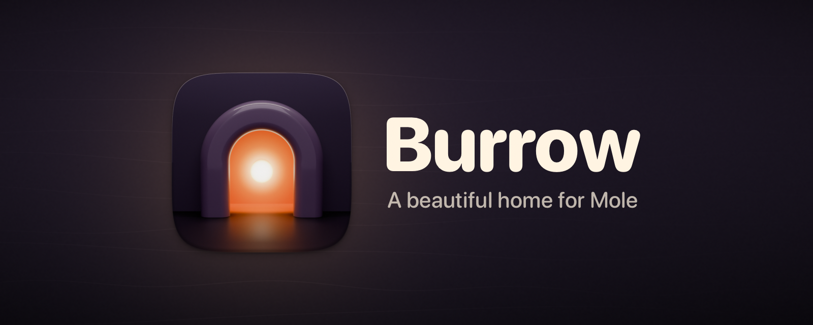
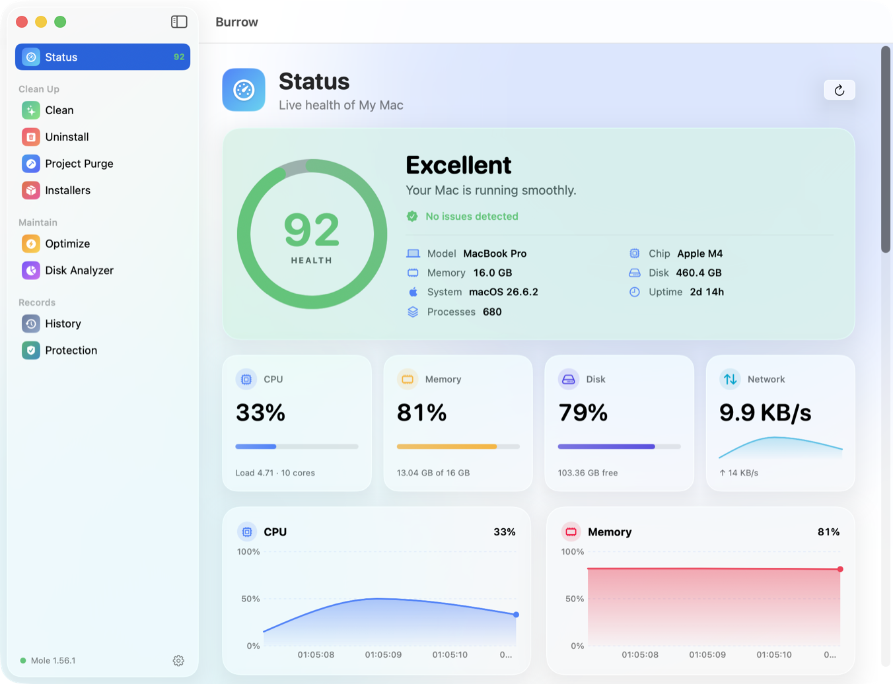
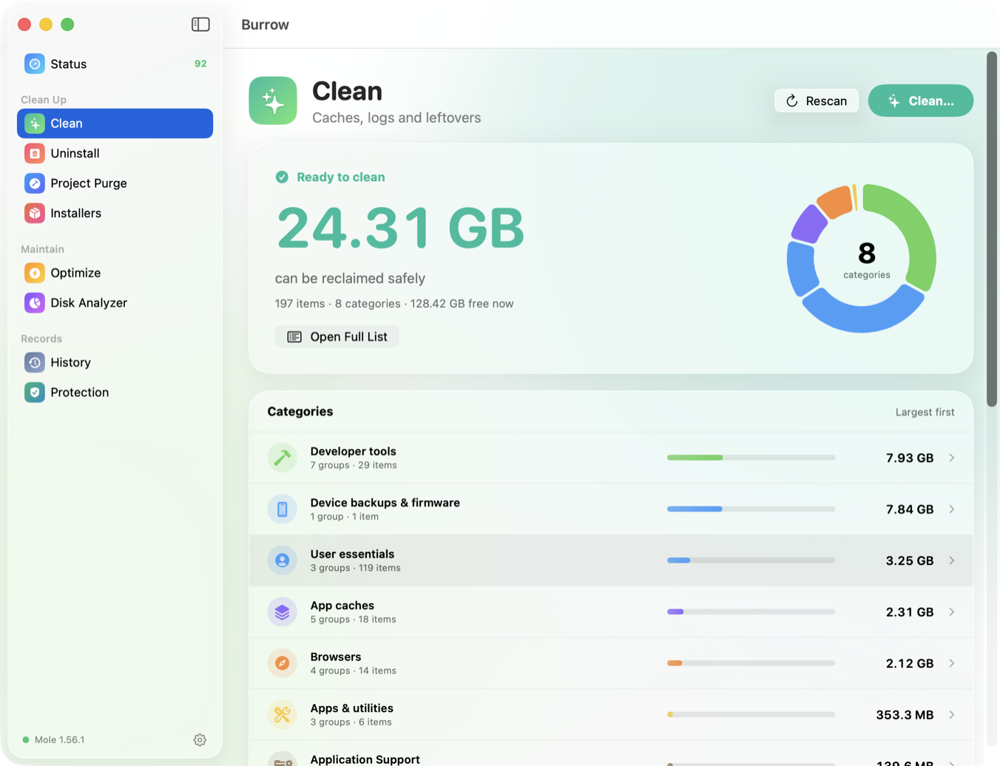
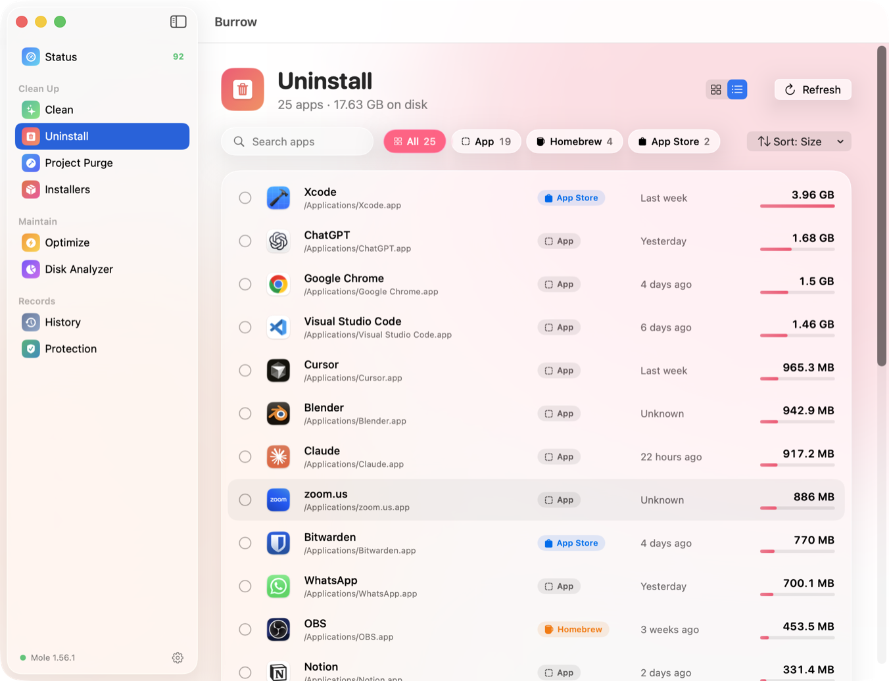
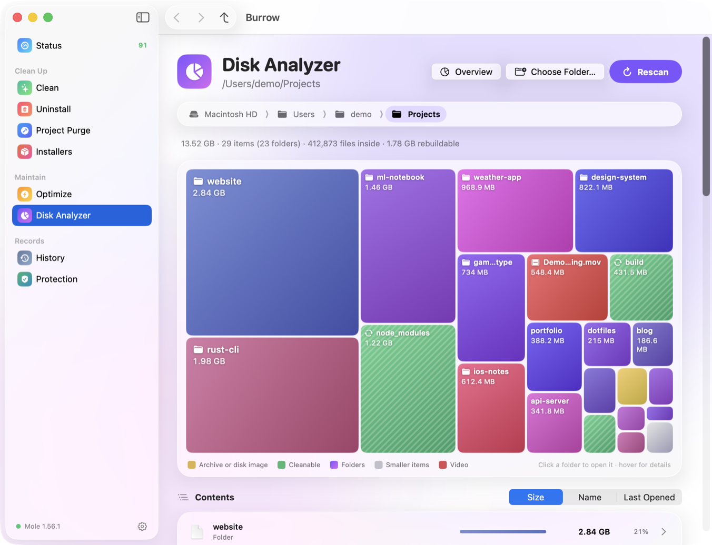
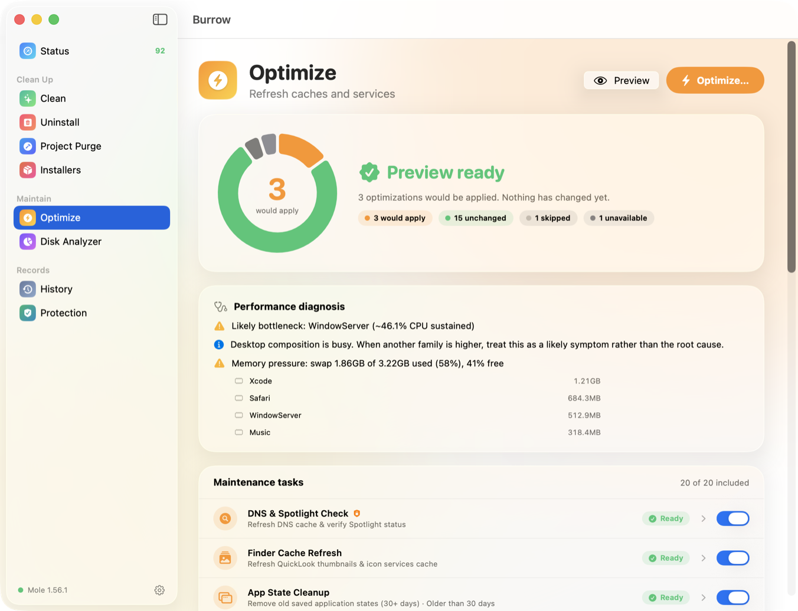
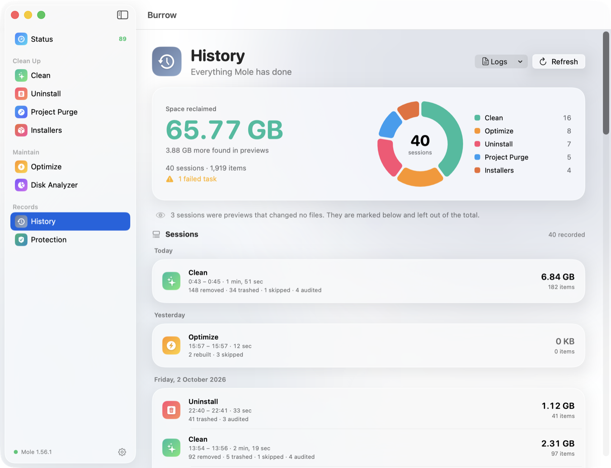
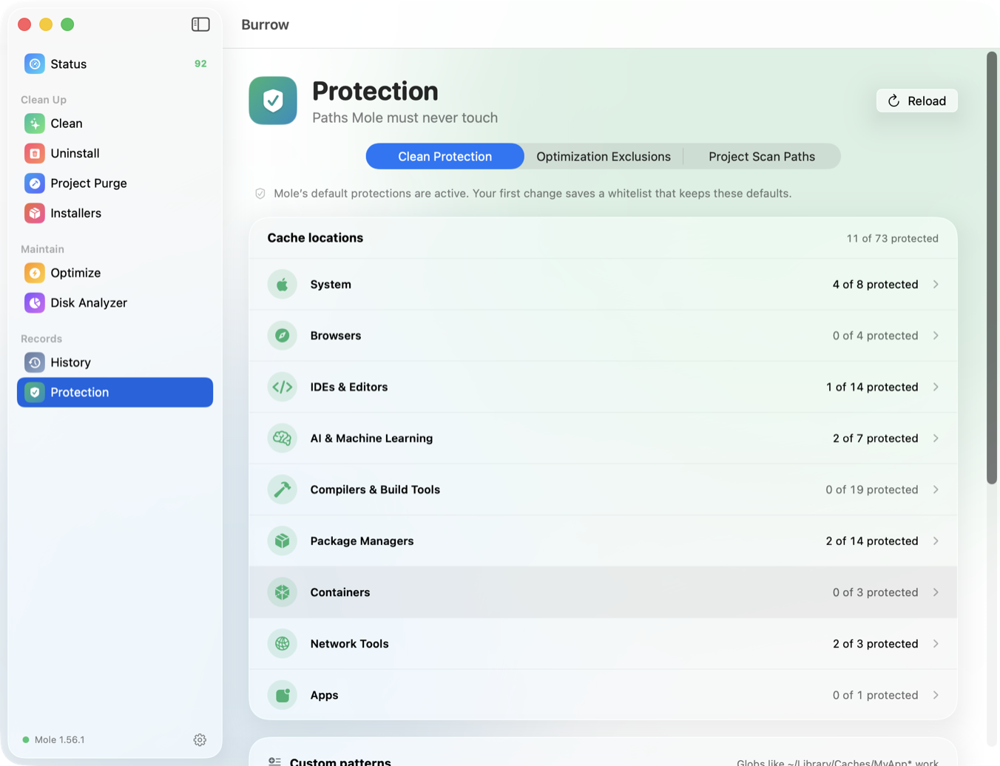

<p align="center">
  
</p>

<p align="center">
  <a href="https://github.com/Pimzino/burrow/actions/workflows/ci.yml"></a>
  <a href="https://github.com/Pimzino/burrow/releases/latest"></a>
  
  
  <a href="LICENSE"></a>
</p>

**Burrow** is a native macOS app for the open-source [Mole](https://github.com/tw93/mole) CLI, which deep-cleans and optimizes your Mac. Burrow gives every Mole command a polished Liquid Glass interface: live system health, guided cleaning, app uninstalling, a disk treemap and more.

Burrow never reimplements Mole's cleaning logic. Every action runs through `mo` itself, so you get the same safety checks, whitelists, logs and history as in the terminal, with a preview and a confirmation before anything is removed.

<p align="center">
  <picture>
    <source media="(prefers-color-scheme: dark)" srcset="docs/screenshots/status-dark.png">
    
  </picture>
</p>

## Features

| | |
|---|---|
| **Status** | A live health score with CPU, memory, disk I/O and network charts, plus disks, battery, power, Bluetooth, top processes and CPU alerts. Burrow also shows the score in the menu bar, with a compact live panel. |
| **Clean** | A dry-run preview that fills in section by section, a drill-down into every file with one-click **Protect**, then a clean that runs exactly the configuration you previewed. Optional system caches (admin), keep the Trash, clean external drives. |
| **Uninstall** | Every app with its real icon, size, last-used date and Homebrew, App Store or Steam badge. Mole's own file-by-file removal plan is shown for review before anything is removed. Removed apps go to the Trash by default. |
| **Disk Analyzer** | A machine overview with "hidden space" insights and a squarified treemap you can drill into. It lists the largest files, and Move to Trash follows Mole's own safety rules. |
| **Optimize** | 20 maintenance tasks with per-task toggles, live progress and performance diagnostics. |
| **Project Purge** | Old `node_modules`, `target`, `.venv`, `DerivedData` and other build artifacts, grouped by project. The list is re-verified just before purging. |
| **Installers** | Leftover `.dmg`, `.pkg`, `.iso`, `.xip` and `.zip` installers, grouped by where they live, with Quick Look. |
| **History** | Space reclaimed, a timeline of every session and a searchable deletion audit. |
| **Protection** | Mole's whitelist inventory, your own protected paths, optimization exclusions and project scan folders, all editable. |
| **Settings** | Signed in-app updates for Burrow itself (from GitHub Releases), Touch ID for sudo, shell completion, Mole updates, logs, launch at login, and uninstalling Mole. |

<table>
  <tr>
    <td width="50%">
      <picture>
        <source media="(prefers-color-scheme: dark)" srcset="docs/screenshots/clean-dark.png">
        
      </picture>
      <p align="center"><b>Clean</b>: preview first, clean exactly what you saw</p>
    </td>
    <td width="50%">
      <picture>
        <source media="(prefers-color-scheme: dark)" srcset="docs/screenshots/uninstall-dark.png">
        
      </picture>
      <p align="center"><b>Uninstall</b>: apps and every leftover file</p>
    </td>
  </tr>
  <tr>
    <td width="50%">
      <picture>
        <source media="(prefers-color-scheme: dark)" srcset="docs/screenshots/analyze-dark.png">
        
      </picture>
      <p align="center"><b>Disk Analyzer</b>: see what fills your disk</p>
    </td>
    <td width="50%">
      <picture>
        <source media="(prefers-color-scheme: dark)" srcset="docs/screenshots/optimize-dark.png">
        
      </picture>
      <p align="center"><b>Optimize</b>: 20 maintenance tasks</p>
    </td>
  </tr>
  <tr>
    <td width="50%">
      <picture>
        <source media="(prefers-color-scheme: dark)" srcset="docs/screenshots/history-dark.png">
        
      </picture>
      <p align="center"><b>History</b>: everything Mole has done</p>
    </td>
    <td width="50%">
      <picture>
        <source media="(prefers-color-scheme: dark)" srcset="docs/screenshots/protection-dark.png">
        
      </picture>
      <p align="center"><b>Protection</b>: paths Mole must never touch</p>
    </td>
  </tr>
</table>

## Install

**Requirements:** macOS 26 Tahoe or later on Apple silicon, and the Mole CLI (`brew install mole`). If Mole isn't installed, Burrow offers to install it for you.

1. Download `Burrow-<version>.dmg` from the [latest release](https://github.com/Pimzino/burrow/releases/latest).
2. Open it and drag **Burrow** into **Applications**.
3. Open Burrow. The first time, macOS will say it **can't verify Burrow**. That is expected (see below). Click **Done**.
4. Open **System Settings → Privacy & Security**, scroll to **Security** and click **Open Anyway** next to "Burrow was blocked". Confirm with your password or Touch ID.

After that, Burrow opens normally. [docs/INSTALL.md](docs/INSTALL.md) has the full walkthrough, including:
- how to check the download's SHA-256 checksum;
- a Terminal alternative;
- the permissions Burrow asks for (Full Disk Access is recommended so Mole can see everything it cleans).

### Why the "can't verify" warning?

Apple only lets an app open without warnings if it is signed with a paid **Developer ID** certificate and **notarized** by Apple. Burrow is a free, independent, open-source project, so releases are signed with a free development certificate and aren't notarized. Gatekeeper therefore asks you to approve it once.

The source code is all here: you can read it, or build it yourself in a few minutes (below). Since macOS 15 Sequoia, the old "right-click → Open" trick no longer works; **Open Anyway** in System Settings is the supported route.

## Build from source

You need Xcode 26 or later (Swift 6.2+). There are no third-party packages.

```bash
git clone https://github.com/Pimzino/burrow.git
cd burrow
./scripts/build-app.sh release    # → build/Burrow.app
open build/Burrow.app
```

```bash
./scripts/make-dmg.sh 1.0.0       # → build/Burrow-1.0.0.dmg (+ .sha256)
```

If you have an Apple Development certificate in your keychain, `build-app.sh` signs with it automatically. macOS then remembers Burrow's privacy permissions between rebuilds; with ad-hoc signing it asks again after every build.

### End-to-end tests

```bash
./scripts/e2e.sh                  # every screen and every Settings tab
./scripts/e2e.sh clean uninstall  # just some
```

Each screen is launched with its **safe** automated action: a scan, a dry run or a listing, never anything destructive. The script waits for the screen's report and captures a screenshot. It writes a repeatable HTML report and a `summary.json` to `e2e-results/<timestamp>/`.

`scripts/screenshots.sh` regenerates the README screenshots in light and dark mode. It runs Burrow against a demo Mole (`scripts/demo/mo`) that serves dummy data and refuses anything that could change your Mac, so the captures never show your own apps, files or devices.

## How it works

Burrow runs `mo` as a subprocess in its own session, so Mole behaves exactly as it does in a non-interactive terminal. Burrow parses Mole's output line by line as it streams, so screens fill in live. Where Mole has JSON output (`status`, `analyze`, `history`, `uninstall --list`), Burrow uses that instead.

- **Administrator access.** Mole only accepts admin rights from a sudo session tied to a terminal. When a task needs them:
  1. Burrow starts a small helper on a private pseudo-terminal.
  2. The helper runs `sudo -v` there and asks for your password in Burrow's own sheet.
  3. It runs Mole in the same session.
  4. It revokes access with `sudo -k` when Mole finishes.

  The password goes straight to sudo. It is never stored, logged or passed on a command line.
- **Prompts are supervised.** Some Mole prompts treat "end of input" as *yes*. Prompt-driven runs go through a supervising helper, so if Burrow quits or crashes mid-prompt, Mole is stopped rather than reading an accidental *yes*. Nothing Burrow starts outlives the app.
- **Previews are binding.** Clean runs only the configuration you previewed. Purge is re-verified with a fresh dry run first. Uninstall refuses apps that Mole could confuse by name.
- **Safe defaults.** Pressing Return never confirms a destructive action. Removed apps go to the Trash by default. Quitting while a task runs asks first.

More detail:
- [docs/ARCHITECTURE.md](docs/ARCHITECTURE.md): code layout and conventions.
- [docs/mole-cli-research.md](docs/mole-cli-research.md): how every `mo` command behaves without a terminal.
- [SECURITY.md](SECURITY.md): security model.

## Brand

The app icon and all brand artwork are rendered procedurally in Blender from [`art/brand/build.py`](art/brand/build.py). Run `art/brand/build.sh` to regenerate them. Colours and usage are in [docs/BRAND.md](docs/BRAND.md).

## Contributing

Issues and pull requests are welcome. Please read [CONTRIBUTING.md](CONTRIBUTING.md) first, especially the safety rules: never automate a destructive action, and test with dry runs.

## Credits and license

Burrow is built on **[Mole](https://github.com/tw93/mole)** by [tw93](https://github.com/tw93) and contributors. All the cleaning, uninstalling, optimizing and analysis is Mole's work. If Burrow is useful to you, please star Mole too.

Burrow is an independent project. It is not affiliated with or endorsed by Mole, tw93 or the separate paid "Mole for Mac" app. See [CREDITS.md](CREDITS.md) for details, including the small pieces of Mole logic Burrow ports.

Burrow is free software under the [GNU General Public License v3.0](LICENSE) (`GPL-3.0-or-later`), the same licence family as Mole.
